# Ejercicios para clase

## Ejercicio 1

Dado el árbol:

```text
        10
       /  \
      5    15
     / \   / \
    2   7 12 20
```

Escriba manualmente:

- Preorden: 10 5 2 7 15 12 20
- Inorden: 2 5 7 10 12 15 20
- Postorden: 2 7 5 12 20 15 10
- BFS: 10 5 15 2 7 12 20

## Ejercicio 2

Modifique el árbol anterior agregando los nodos 1, 3, 18 y 25. Ejecute nuevamente los recorridos.
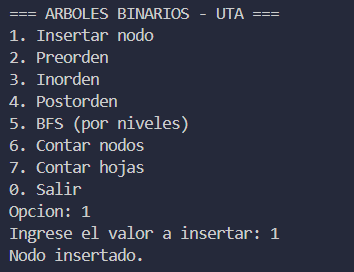
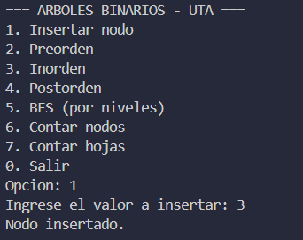
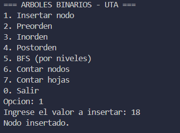
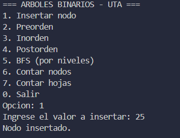
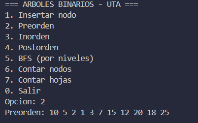
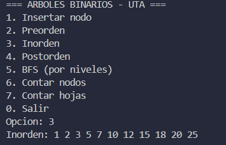
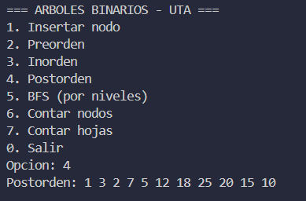
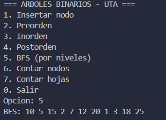

## Ejercicio 3

Implemente una función que cuente la cantidad total de nodos del árbol.

Función para contar nodos totales: 

C++:
- 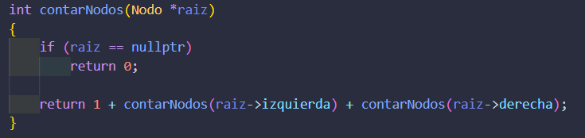

Java:
- 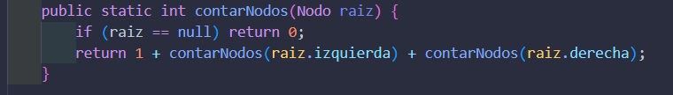

Impresión en pantalla:
- 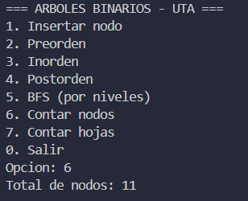

## Ejercicio 4

Implemente una función que cuente las hojas del árbol.

Función para contar las hojas del arbol:

C++:
- 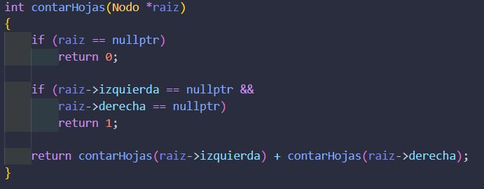

Java:
- 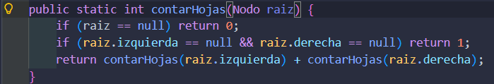

Impresión en pantalla:
- 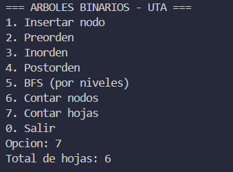

## Ejercicio 5 aplicado al proyecto final

Represente los módulos de un sistema web como un árbol binario. Ejemplo:

```text
            Sistema Web
           /           \
     Usuarios        Inventario
      /    \          /      \
 Registrar Buscar  Productos Reportes
```

Explique qué recorrido usaría para:

1. Mostrar el menú principal.
2. Procesar primero los módulos internos.
3. Mostrar módulos nivel por nivel.

Aplicando el ejemplo mostrado al proyecto SmartCampus UTA el resultado del arbol binario serio al siguiente:

                  SmartCampus UTA
                   /           \
             Usuarios         Gestión
              /    \          /     \
         Registrar Buscar Trámites Reportes
                           /   \
                       Turnos Documentos

Explicación de los tres recorridos:

1. Preorden "Mostrar el menú principal":
   El orden es raíz → izquierda → derecha. Se visita el módulo padre antes que sus hijos. En tu sistema esto aplica perfectamente al renderizar el menú de navegación: primero aparece el menú principal (SmartCampus UTA), luego los submenús (Usuarios, Gestión) y finalmente las opciones internas (Registrar, Buscar, etc.).

2. Postorden "Procesar primero los módulos internos":
   El orden es izquierda → derecha → raíz. Se procesan los módulos hoja antes que sus padres. Esto es útil en SmartCampus para inicializar los servicios: por ejemplo, el servicio de Turnos y Documentos deben estar listos antes de que Trámites pueda funcionar, y Trámites antes de que Gestión esté disponible.

3. Por niveles (BFS) "Mostrar módulos nivel por nivel":
   Se visitan todos los nodos de un mismo nivel antes de bajar al siguiente. En tu sistema serviría para mostrar los módulos de forma progresiva en la interfaz: primero la pantalla principal, luego las secciones principales, luego las subsecciones, y así hasta llegar a las funcionalidades más específicas.
